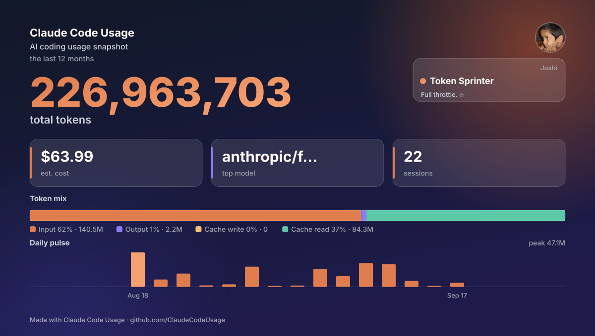

# Joshi Sankarsh 👋

**AI/Backend Engineer** — building systems that actually *do* things: agents, memory, RAG, automation.

```
Python • FastAPI • LangChain • PostgreSQL • Docker
Currently exploring: agentic workflows, local LLMs, persistent AI memory
```

---

## What I'm Building

I care about backend architecture and AI systems more than frontend polish — the interesting problems for me are in how models reason, remember, and act, not just how they render.

- 🧠 **AI Agents & Memory** — persistent context, retrieval, multi-step reasoning
- 🔍 **RAG & Local LLMs** — offline-first, privacy-conscious AI pipelines
- ⚙️ **Backend Systems** — APIs and infra that hold up in production, not just demos

## Selected Projects

| Project | What it does |
|---|---|
| **[MemoryOS](#)** | Hierarchical AI memory system — embeddings, summarization, long-term context retrieval |
| **[Sahayatha](#)** | Multilingual, voice-first government services platform with RAG + local LLMs (Telugu support) |
| **[w-agent](#)** | WhatsApp reminder agent with document memory — Flask, PostgreSQL, S3, multimodal AI |
| **[idea2Build](#)** | Generates system designs & Terraform infra from a product idea, via Amazon Bedrock |
| **[Chat-with-PDF](#)** | Fully offline RAG assistant — LangChain, ChromaDB, Ollama |

## Stack

**AI/ML:** PyTorch · Hugging Face · LangChain · Ollama · RAG · Agents · VLMs  
**Backend:** Python · FastAPI · Flask · Node.js  
**Data:** PostgreSQL · CockroachDB · ChromaDB · DynamoDB · Redis  
**Infra:** Docker · AWS · Azure · Terraform · Nginx · Linux  
**Frontend (when needed):** React · Next.js · Tailwind  

## Track Record

- 🏆 Winner, Yukthi Manthan AI Hackathon (₹25K prize)
- 🎯 National AI Olympiad 2025 — Rank 184 nationally, 11 in Telangana; 80%+ in Computer Vision, Deep Learning, Generative AI, and Agentic AI
- 🔁 12+ hackathons, still shipping

## How I Work With AI Tools

I use LLMs to move faster — prototyping, debugging, exploring design options — but the architecture, trade-offs, and decisions are mine. Understanding the system beats generating around it.

<p align="center">
  
</p>

## Reach Me

📧 [joshisankarsh45@gmail.com] · 💼 [https://www.linkedin.com/in/joshi-sankarsh-6a8981269/] 

> Make it work. Make it useful. Then make it scale.
